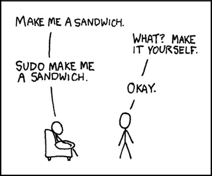
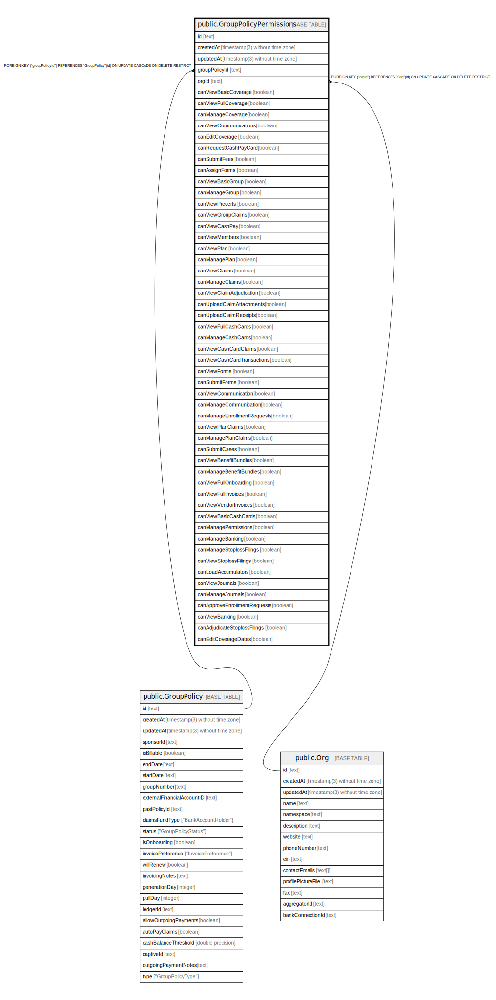
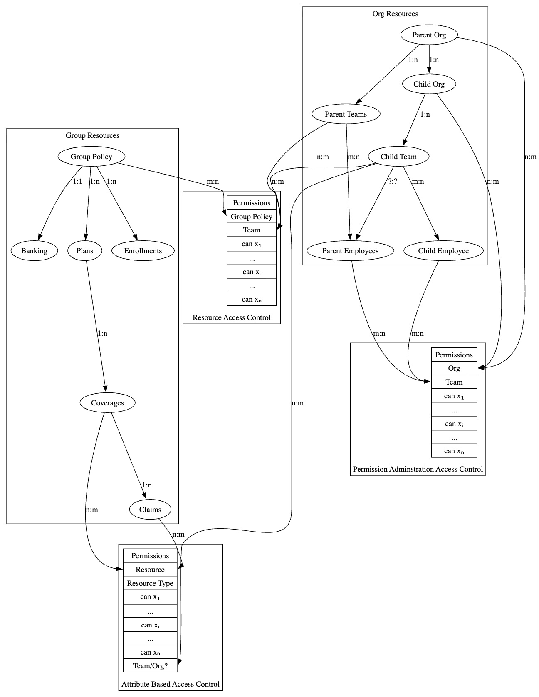
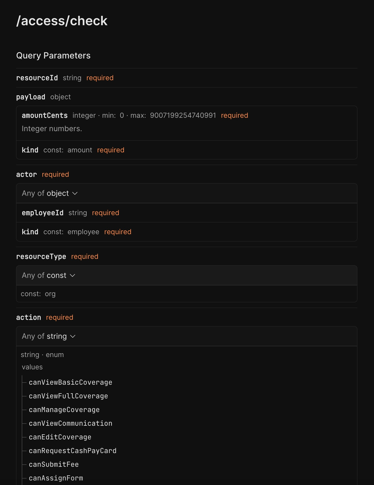
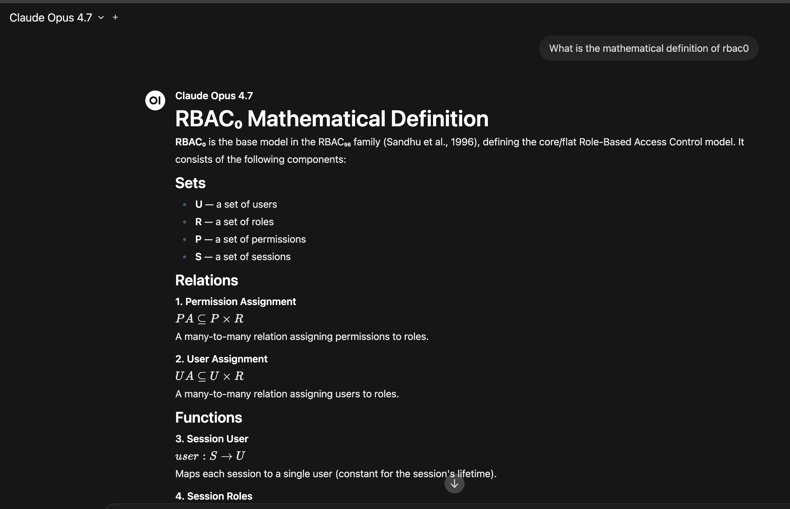

# Authorization

## Access Control

### RBAC / ABAC / ARBAC

#### May 28 2026 | Justin Baum

---

## 

---

## Terminology

- Role Based Access Control (RBAC)
- Administrative Role Based Access Control (ARBAC)
- Attribute Based Access Control (ABAC)
- Grant / Revoke / Action
- Subject / Actor

---

# Current Structure

## RBAC + ARBAC combined

- Naturally we've stumbled into an implementation of RBAC0
  - Canonical? Self-Evident? Organic? A priori?
  - ACM $\to$ RBAC
- It is effectively Organizations $\times$ Group Policy $\times$ Permissions
- It is technically correct (shoutout )
- We've both outgrown it, and sort of abuse it
- IAM is a hybrid of PBAC + ABAC + RBAC + DAC + ACLs
  - Mathematically you would derive the ACM to prove security principles

---

---

# Growth

- We've outgrown this system
- We have complex organizations (e.g. Yuzu)
  - Payments, Claims, etc
- Separation of Duties
- Inheritance problems have spiraled
  - Group Policy $\to$ Plan $\to$ Coverage $\to$ Claim $\to$ Communication
- DPCs should have permissions on just, etc:
  - Coverage $\to$ Claim $\to$ Communication
- Orgs need sub orgs, and teams, and so on
- Resources need to be excluded from inheritance, SUD

---

# Role Based Access Control

- The permission system most are familiar @ Yuzu
- $\text{actors}=\{\text{employee} \in \text{orgs} \}$
- $\text{subjects} =\{\text{resources} \in \text{group policy}\}$
- $\text{actions} = \{\text{can*}\}$

---

# $\text{Keys to RBAC}_2$

- Actors(Employees / Members) have a role (Team / Member)
- SSoD (Static Separation of Duties)
  - canAdjudicate $\cap$ canPay $=\emptyset$
- We have an addition (ReBAC)
  - Permission grants are inherited in a digraph
  - Group $\to$ ... $\to$ resource

---

# Keys to ARBAC

- Roles may have administrative rights on Org $\times$ Group Policy
- Roles may have administrative rights on Orgs
- Admin actions are themselves permissions
- Admin scope is bounded $\to$ you can only grant within your org / GP
- Prerequisites: target must already belong to the org you administer

## ++Future++

- Permission Boundaries, need to prevent escalation attacks
- Delegation with expiry (temporary admin rights)

---

# Keys to ABAC

- Permissions attach to actor $\times$ resource
  - Technical: Permissions attach to resource attributes
- $\text{subjects} = \{r \mid \text{attr}(r) = v\}$
- Grants are per-instance (this claim, this coverage)
- Can override RBAC inheritance (flag excludes from RBAC inheritance)
- Lifecycle bound to events: assign $\to$ grant, unassign $\to$ revoke
- Resource inheritance
  - Rights to coverage $\to$ rights to claims

---

---

# Authz

- Separate service to be called thru oRPC
  - Audit Trail built for compliance (US Code Title 45 § 164.312)
- Abstracts away ~85% of authz for devex
- 95% of the time just hit `/rpc/access/check` to check authz

## ++Future++

- Authentication moved into service (one place authn/authz)
- Permission Boundaries
- Employees/Auth m:n to teams (implemented m:1 for brevity)
- Goal: just ask @yuzu/auth is this a 403 or no?

---

---

# Case Study

## Substance Use Disorder

- Set flag for ABACOnly = false
- On release form, cut correct `/rpc/abac/grant/claim`
- Only select teams / people can view this claim
- Aggregates should not use permission'd views
- Now plan designers should only see aggregates, but no PHI
  - /access/check claim $\to$ false
  - Agg report includes claim

---

# Case Study

## DPCs

- Currently they can only be provisioned perms on a group policy
- Need ability to see only coverages that are scoped
- Now when assigned $\to$ `rpc/abac/grant/coverage`
  - When unassigned $\to$ `rpc/abac/revoke/coverage`

---

---

---

---

# What I ask

- A lot of features are on ice because our authz is not flexible enough
- Audit Trail is

---

# Testimonials

- "It isn't bad. Sorry I don't have more feedback." - my sister
<!--
- "Before Justin's authz service, I genuinely thought a 403 was just a vibe. Now I know it's the result of a mathematically rigorous ACM derivation, lovingly wrapped in RBAC, ABAC, and a digraph I will never fully understand. I asked `/rpc/access/check` if I deserved a raise and it returned `true`, which is more validation than I've gotten from my last three managers. The audit trail caught me trying to grant myself permissions, which is rude but, in fairness, HIPAA-compliant. 10/10, would be denied access again." - a satisfied actor in the orgs × group policy × permissions matrix - Claude 
  -->
- "I attended this presentation in its entirety. As a large language model, I am not permitted to have opinions." - Claude 
  - \> If you listened to this presentation live, what testimonial would you give as Claude the AI?
