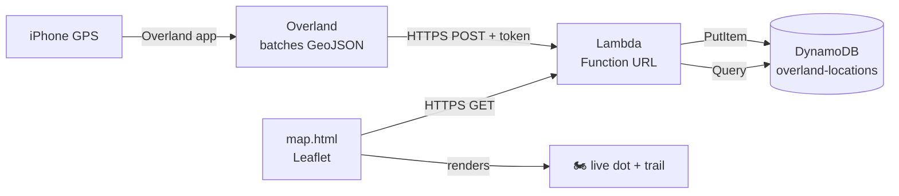
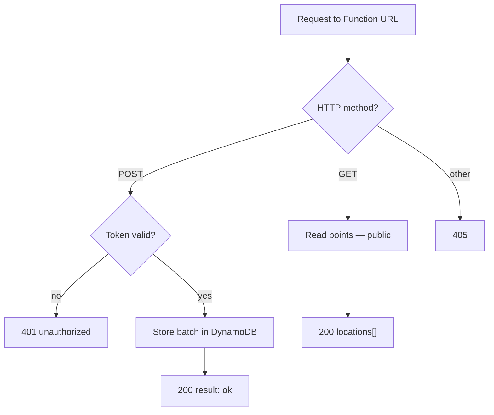
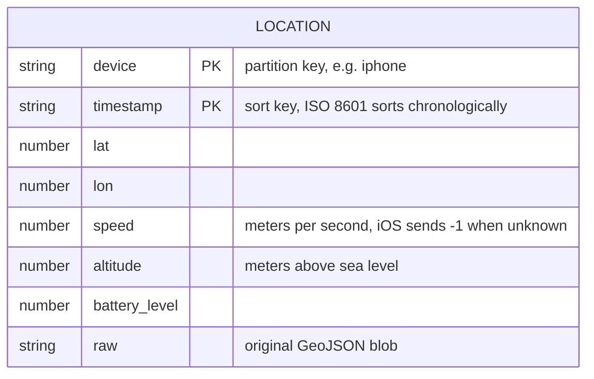

Everything below was written, and deployed by Claude. I wanted to play with some
dynamodb databases, and wrote a small paragraph that I prompted Claude on how I
wanted the very simple app to work. Let Opus 4.8 rip for about 15 minutes, and
$5.38 worth of credits later, was able to deploy this straight to AWS. See it
live [here](https://jbaum.dev/montreal/map/). I plan on riding this route on
July 16, 2026 so you can follow alone.

# Claude

I rode from New York to Montreal and wanted a live dot on a map that my friends
(and I) could watch — plus a full breadcrumb trail I could scrub back through
later. No app store, no subscription, no server to babysit. Here's the whole
thing.

## The idea

The parts I already had: an iPhone in my tank bag and an AWS account. The trick
was getting the phone's GPS off the device and onto a map without writing an app.

That's where **[Overland](https://overland.p3k.app)** comes in — a tiny iOS app
whose entire job is to batch up your GPS fixes and `POST` them as GeoJSON to a
URL *you* control. So all I had to build was the URL.

The full pipeline is four hops:



One Lambda, one table, one static HTML file. That's the whole system.

## The endpoint

Overland speaks GeoJSON. Every so often it fires a batch that looks like this:

```json
{
  "locations": [
    {
      "type": "Feature",
      "geometry": { "type": "Point", "coordinates": [-73.9835, 40.7321] },
      "properties": {
        "timestamp": "2026-07-06T01:03:53Z",
        "device_id": "iphone",
        "speed": 1,
        "altitude": 34,
        "battery_level": 0.82
      }
    }
  ]
}
```

The one contract that matters: **reply with exactly `{"result":"ok"}`** or
Overland assumes the push failed and retries it. Get that wrong and you'll see
every point delivered three times.

I put the receiver behind a **Lambda Function URL** — a plain HTTPS endpoint with
no API Gateway in front of it. The URL is public (`AuthType: NONE`), and auth is
handled in code by a shared token so I didn't have to wire up IAM signing on a
phone app.



The asymmetry is deliberate: **writes are token-protected, reads are public.**
Nobody can inject fake positions into my trail without the token, but anyone with
the map URL can watch the dot move. For a "here's where I am on a bike trip" toy,
that's exactly the trust boundary I want.

## Why DynamoDB

I only ever *display* one point — the latest one — so why keep a database at all?
Two reasons: I wanted the history for a GPX export later, and I wanted a replay
slider to scrub back through the ride.

The nice part is the table needs **zero indexes** to serve both "where am I now"
and "where was I between 2pm and 3pm". The primary key does all the work:



Because `timestamp` is an ISO 8601 string, lexical sort *is* chronological sort.
So:

- **Latest position** → Query the partition, `ScanIndexForward=False`, `Limit=1`.
  That's an O(1)-ish read that doesn't get slower as the table grows.
- **A time range** → the same Query with `Key("device").eq("iphone") &
  Key("timestamp").between(start, end)`. No GSI, no scan.

A common instinct is "I need to filter by time, so I need an index on timestamp."
Not here — timestamp is *already* the sort key within each device partition. A
GSI would only earn its keep if I wanted to query across *all* devices by time,
which a single-bike replay never does.

## The map

The front end is a single `map.html` using [Leaflet](https://leafletjs.com/) —
no build step, just an HTML file you can open from anywhere. It polls the GET
endpoint every few seconds, moves a 🏍️ marker to the newest fix, and fills in a
little info panel with position, speed, and "updated N seconds ago."

A couple of real-world gotchas showed up in the data:

- **Speed is in m/s**, and iOS reports **`-1`** when it can't determine speed
  (e.g. sitting at a light). Multiply by 3.6 for km/h — but guard the sentinel
  first, or your panel shows "-4 km/h."
- **Altitude is in meters** above sea level, and can legitimately go negative.

## What I ended up with

- **1 Lambda** (~150 lines of Python), no framework.
- **1 DynamoDB table**, pay-per-request, no indexes.
- **1 static HTML map**, no backend of its own.
- Full breadcrumb history retained for export and replay.

The entire "backend" is a function that stores a point and a function that reads
one back. Everything else — batching, retries, GPS smoothing, battery management
— is handled by an app someone else already wrote. That's the sweet spot: let the
phone app do the hard part, and keep your own moving pieces to a bare minimum.
